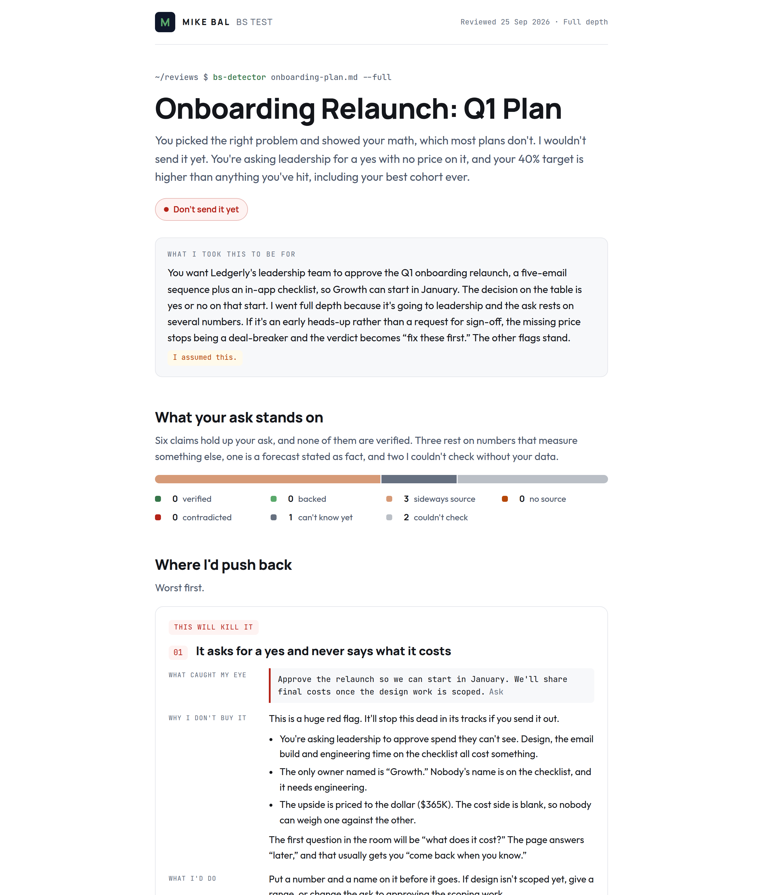

# bs-detector

**An Agent Skill that runs a BS test on anything you're about to put your name on:** a spec, deck, strategy doc, analysis, proposal, or post. It tells you what will get you called out, why, and how to fix it, before your audience finds it for you.



See the full example: [the input document](examples/onboarding-plan.md), [the report](examples/onboarding-plan-bs-test.html) (download and open it in a browser), and [the ledger behind it](examples/onboarding-plan-ledger.md). The company in it is made up.

> **It ships in Mike Bal's brand and voice.** Reports look like [mikebal.com](https://mikebal.com) and read like Mike walking you through your doc: "I don't buy it, and here's why…". A neutral brand is included, and switching takes one line. See [Make it yours](#make-it-yours).

## What it does

1. **Confirms the goal first.** It tells you what it thinks the document is for, who reads it, and what decision it drives, then waits for you to correct it. Wrong goal, wrong grades.
2. **Reads it cold.** A blind read, with no context, catches what only makes sense if you already know the backstory.
3. **Grades the claims your ask stands on:** verified, backed, sideways source (a real number that measures something else), no source, contradicted, can't know yet, or couldn't check. It recomputes your math from your own figures.
4. **Asks whether anyone will actually believe it**, separately from where it came from. A cited claim can still fail the straight-face test, and that's a bigger problem than a missing footnote. If it doesn't hold up, you get told: *"I don't buy it. No one else will either."*
5. **Catches what you've stated as settled** when it's a judgment call, an estimate or still open, and the assumptions carrying your argument that you never actually examined.
6. **Checks your blockers are real.** Things called blocked, required, impossible or not allowed, where nothing shows that they are, and the plan bends around them anyway.
7. **Cuts the bloat.** Whether your point can be said in one line, how many words aren't doing any work, and AI overwriting: prose that's been composed rather than thought through, reads beautifully and says nothing. Clarity gets checked on every run, at every depth.
8. **Sets severity with a rubric**, not a vibe. Every flag maps to a written criterion. See [the severity rubric](skills/bs-detector/references/severity-rubric.md).
9. **Verifies before it complains.** It checks every flag for a verbatim quote, a real contradiction, and no invented numbers.
10. **Hands you a report** with a verdict per audience and up to 7 flags. Each flag has three parts, *What caught my eye / Why I don't buy it / What I'd do*, plus replacement sentences you can copy.

It's blunt about the call and fair about the work: it credits what's working, it won't flag prose just because it would have written it differently, and it never guesses at who or what wrote your document.

## Install

The skill is one folder, [`skills/bs-detector`](skills/bs-detector), in the open [Agent Skills](https://agentskills.io) format.

### Claude Code

```
/plugin marketplace add that-mike-bal/bs-detector-skill
/plugin install bs-detector@mikebal
```

Or copy `skills/bs-detector` into `~/.claude/skills/` (just for you) or `.claude/skills/` in a project.

### Claude apps (claude.ai, desktop, Cowork)

1. Download `bs-detector.zip` from [Releases](../../releases), or build it with `./scripts/build-zip.sh`.
2. Go to **Customize > Skills**, click **+**, then **Create skill > Upload a skill**, and upload the zip.
3. **Code execution and file creation** must be on. Free, Pro and Max plans find it in **Settings > Capabilities**. On Team and Enterprise plans, an owner turns it on.

On Team and Enterprise plans you can share the skill with colleagues, or publish it to your organization, from its menu in **Customize > Skills**. Skills enabled in your Claude account also sync to Claude Code. See [Use skills in Claude](https://support.claude.com/en/articles/12512180-use-skills-in-claude).

### Codex

Copy `skills/bs-detector` into `~/.agents/skills/` (just for you) or `.agents/skills/` in a repository. Invoke it with `$bs-detector`, or ask in plain words. The optional `agents/openai.yaml` sets its display name. See [Build skills](https://developers.openai.com/codex/skills).

### Other Agent Skills clients

Copy the `skills/bs-detector` folder into your client's skills directory. It uses only the standard `SKILL.md` layout.

## Use it

Ask for it in plain words: "BS test this", "pressure test this deck", "red team my plan", "fact-check this", "poke holes in this", "is this too wordy", "does this actually say anything", or "is this ready to send?"

It picks a depth and tells you which: **quick** for short, low-stakes copy; **normal** for most documents; **full** for anything going to execs, a board, investors or the public.

### It works best with, and without

| With | It will | Without it, it will |
|---|---|---|
| Subagents | Run a blind read first, then up to six review lanes in parallel, each isolated | Run the lanes itself, in order |
| Web search | Check outside claims against current sources | Mark those claims "couldn't check", never "verified" |
| Connected apps (drive, docs, analytics) | Check your internal numbers against the source | Ask you for the source, or mark them "couldn't check" |
| A page publisher (Claude Artifacts) | Publish the report as a private page you can share | Write a standalone HTML file and give you the path |

The file opens in any browser. Offline, it falls back to system fonts.

### Tested on

| Client | Status |
|---|---|
| Claude agent, no subagents, no publisher (the local-file path) | Tested end to end, twice. The [example report](examples/onboarding-plan-bs-test.html) came from the second run. |
| Claude Code plugin install | Installs and validates (`claude plugin validate`). |
| Agent Skills spec | Passes `skills-ref validate`. |
| Claude Cowork / claude.ai with Artifacts | Not yet tested |
| Codex CLI | Not yet tested |

## Make it yours

All report branding lives in one file under [`skills/bs-detector/brand/`](skills/bs-detector/brand). The line `Active brand: brand/mikebal.md` in `SKILL.md` picks which one.

- **Go neutral:** change that line to `brand/neutral.md`. That brand uses system fonts, slate and blue, no logo tile, and a plain first-person voice.
- **Make your own:** copy `neutral.md` to `brand/yourname.md`, edit it, and point the line at it. A brand file has three parts:
  1. **Identity:** wordmark, logo tile letter, report label, prompt, footer credit, and a Google Fonts `family=` string. Published Claude artifacts only load fonts from Google Fonts.
  2. **Voice:** whose voice it is, 5–8 things you actually say when you push back (take them from real review comments or Slack messages), your three severity labels, and the section titles. This matters more than the colors.
  3. **Tokens:** a CSS block of colors and fonts. Repeat any change in both dark-mode blocks. Keep `--red` and `--amber` for stop and warn. Aim for 4.5:1 contrast on text.
- **One report only:** say "BS test this, but use the neutral brand" (or name another brand). The skill applies it to that run and leaves the setting alone.
- **Let Claude do it:** say "make a bs-detector brand file for me" and give it your site, your colors and fonts, and a few messages where you gave someone feedback.

**Forking?** Your name and colors also appear in `.claude-plugin/` (marketplace name `mikebal`, author), `agents/openai.yaml` (display name, brand color), and the `metadata` block at the top of `SKILL.md`.

The layout lives in [`assets/report-template.html`](skills/bs-detector/assets/report-template.html) and is brand-neutral. Leave it alone unless you're changing the report's design for everyone.

## How reports read

A flag from the example report, abridged:

> **This will cost you credibility**
> **02 · Your 40% target beats the best cohort you've ever had**
>
> **What caught my eye:** "The new sequence will lift first-week activation from 22% to 40% by the end of Q2." (Summary, para 2)
>
> **Why I don't buy it:** I get where you're going, but you're reaching too far from where you are, and it isn't grounded in anything you can hit yet.
> - Your best cohort ever reached 35%, and those were webinar attendees who chose to show up. You're promising 40% across every new signup.
> - Only 31% open the first email, about 2,790 people a month. If the emails carry the lift, 1,620 more activations means 58% of those openers newly connecting a bank.
> - You wrote "will," but this is a bet.
>
> Someone in the room will call you on this. Once they do, they'll discount every other number on the page.
>
> **What I'd do:** Keep the ambition, but call 40% a stretch goal, say what it rests on, and give the number you'd call a win.
> *Paste:* "We're aiming to lift first-week activation from [baseline]% to 40% by the end of Q2. Our best cohort so far reached 35%, so 40% is a stretch goal. We'd count [X]% as a clear win."

## What's in the repo

```
skills/bs-detector/
  SKILL.md                       the workflow
  references/severity-rubric.md  levels, criteria, patterns and worked examples
  assets/report-template.html    the report layout
  brand/mikebal.md               default brand and voice
  brand/neutral.md               unbranded preset
  agents/openai.yaml             optional metadata for Codex and ChatGPT
examples/                        a fictional input, its report, ledger and screenshots
.claude-plugin/                  Claude Code plugin and marketplace manifests
scripts/build-zip.sh             builds the upload zip for Claude apps
```

## What it does with your document

The skill is instructions and a template. It has no scripts and sends nothing anywhere on its own. What it reads and checks depends on the tools your client gives it: web search for outside claims, and any apps you've connected for internal numbers.

**Your document stays in the review.** When it checks an outside claim, it searches the public fact behind that claim in its own words, never your sentence, and never an unreleased figure, price, vendor, customer or date. Anything it can't check without exposing something private is graded "couldn't check", and it tells you which internal source to connect instead. It writes its working files to a `review/` folder in your working directory. If that's a git repository, add `review/` to `.gitignore`. A report published as a Claude artifact is private until you share it.

## License and credits

MIT. See [LICENSE](LICENSE). Created by [Mike Bal](https://mikebal.com). Contributions welcome, especially new brand files and test reports from clients not yet listed under [Tested on](#tested-on).
